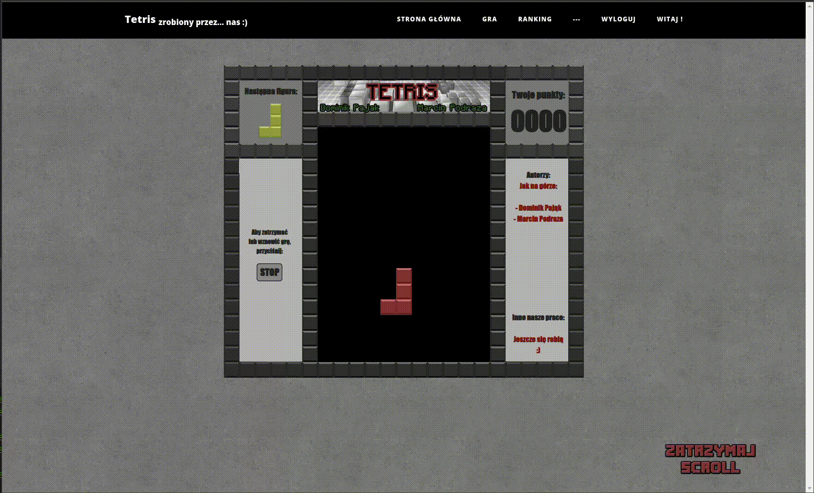

# Tetris - School Project (2018)

## Description
This repository contains a Tetris game created as a school project in 2018. It's a simple implementation of the classic puzzle game where blocks fall and must be arranged to clear lines and gain points.

## Technologies
This project was developed using HTML, CSS, JS, PHP, MySQL.

## Purpose of Publication
This codebase is published as a memento of my early days in programming. It's a snapshot of my learning journey and showcases the progress I've made since this initial foray into coding.

---

*This project is a documentation of my beginnings in the coding world and is published solely for archival purposes.*